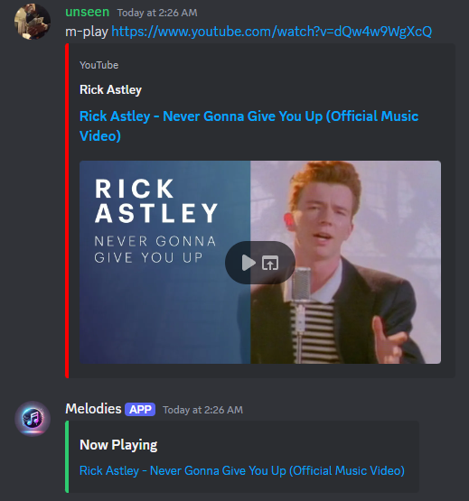

# Discord Music Bot 🎶

A simple Discord music bot built with Python and `discord.py` that plays music from YouTube, SoundCloud, Vimeo, and [other platforms](https://github.com/yt-dlp/yt-dlp/blob/master/supportedsites.md) using `yt-dlp` and FFmpeg. It includes basic music commands such as play, skip, queue, pause, resume, and more.

## Features

- 🎧 Play music from YouTube and SoundCloud.
- ⏯️ Pause, resume, and skip songs.
- 📃 View the current song queue.
- 🎶 "Now Playing" information with clickable links to the songs.
- 🛑 Role-based command restrictions (e.g. only users with the "DJ" role can skip songs).
- 🔒 Secure handling of environment variables for bot tokens and other sensitive data.

## Commands
🔹 `m-play <url>` - Play a song from a URL (YouTube/SoundCloud).

🔹 `m-skip` - Skip the currently playing song (DJ role).

🔹 `m-pause` - Pause the currently playing song (DJ role).

🔹 `m-resume` - Resume the paused song (DJ role).

🔹 `m-queue` - Show the current song queue.

🔹 `m-np` or `m-playing` - Show the currently playing song.

🔹 `m-join` - Join the voice channel.

🔹 `m-leave` - Leave the voice channel.


## Setup

### Prerequisites

- Python 3.8 or later installed. Download Python [here](https://www.python.org/downloads/).
- A Discord bot and token. Learn how to set up and invite a Discord bot to your server [here](https://discordpy.readthedocs.io/en/stable/discord.html).

### Installation

1. **Clone the repository**:

   ```bash
   git clone https://github.com/awnold/Discord-Music-Bot.git
   cd Discord-Music-Bot
   ```

2. **Install dependencies**:

   ```bash
   pip install -r requirements.txt
   ```

3. **Create a `.env` file** in the project root and add your Discord bot token:

   ```plaintext
   DISCORD_TOKEN=your_discord_bot_token
   ```
   - **NOTE:** Do not put quotes around the token!

4. **Make sure FFmpeg is installed** on your system and accessible in your system's PATH.

   - Download the FULL FFmpeg Windows build from gyan.dev [here](https://ffmpeg.org/download.html).
   - Extract the folder to an easily accessible folder and rename the extracted folder to `ffmpeg` (e.g. `C:\ffmpeg`)
   - Add a new value to your system's PATH environment variable pointing to FFmpeg's bin folder (e.g. `C:\ffmpeg\bin`)

### Run the bot

After completing the setup, you can run the bot with:

```bash
python bot.py
```

### Play a song
- Join a public voice channel
- Type `m-play https://www.youtube.com/watch?v=dQw4w9WgXcQ` in a public text channel

The bot will connect to your Discord server, ready to play music! 🎶

## Contributing

Feel free to submit a pull request if you'd like to contribute to the project. Issues and bug reports are welcome!

Everything I make is free, but if you're feelin' extra generous, you could [Buy Me a Coffee](https://buymeacoffee.com/awnold) ☕💚
